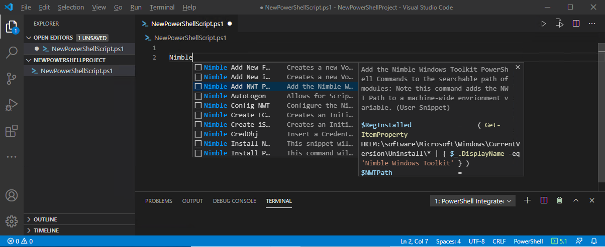

# HPE DEV VS Code Snippets
A VS Code snippet collection which exposes commonlly used PowerShell snippets for HPE Nimble Storage.

## What's in the extension
* This folder contains all of the files necessary for your Snippet extension.
* `package.json` - this is the manifest file that defines the location of the snippet file(s) and how to install them.
* `snippets/hpe-dev_storage-snippets_powershell.json` - the snippet definition file.

## Get up and running straight away
* Press `F5` to open a new window with your extension loaded oir restart VSCode.
* Open a new or existing PowerShell Project.
* Start typing 'nimble' as a prefix and the collection of snippets will appear in a pop-up window. 
* You may use the up and down arrows to navigate to the various different snippets, and in doing so you can read the descriptions of each
* Hit the escape key if you want to continue typing without selecting one of the snippets.
* Or hit enter to select the snippet and it will be inserted into your file at the location of your cursor.
* if the snippet requires defined user-input fields, you will be able to tab to these fields to fill in the required or missing information.

## Make changes
* You can relaunch the extension from the debug toolbar after making changes to the files listed above.
* You can also reload (`Ctrl+R` or `Cmd+R` on Mac) the VS Code window with your extension to load your changes.
* When editing snippets, you can delete individual snippets, or to add your own snippets, you can more easily add 'user-defined' snippets. 
* If you have additional snippets you would like to add and share with the world, please consider submitting them to the github project
located at https://github.com/chris-lionetti/hpe-dev.storage-snippets once you have reviewed the CONTRIBUTING.MD file to ensure that you 
understand the requirements for a sucessfull submission. 

## Install the extension
* To start using your extension with Visual Studio Code copy it into the `<user home>/.vscode/extensions` folder and restart Code.
* once this extension is posted on the HPE Github site, and submitted to the Extension Gallery, you will search for 'HPE' and find this extension and automatically install it.

